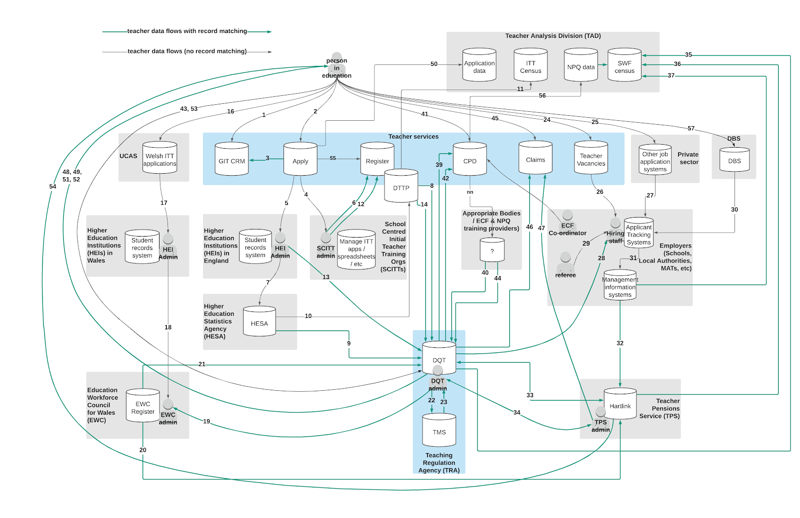
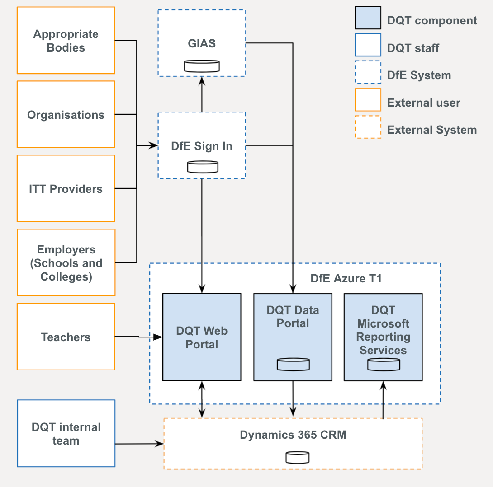

# Architecture and integrations

The current TRA architecture is as follows:

DQT is set up as follows: 

The DQT has relationships with the following services and systems: 

* HESA web portal
* Teachers Pension Service
* EWC Wales
* GIAS
* DfE Sign In
* DfE Azure Platform
* GovPaas Platform
* MS Dynamics 365
* Globalscape EFT
* Teacher Claim (via Qualifications API)
* Teacher CPD (via Qualifications API)
* Register
