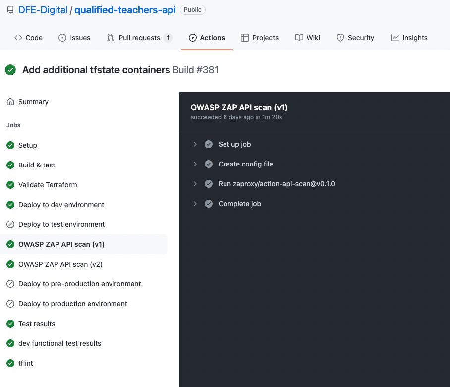

# Continuous Security Validation

We have added continuous security validation into our CI/CD pipelines. Including security when building applications significantly reduce production releases' chances of exploitable flaws and vulnerabilities. 

We decided to adopt a combination of automated and manual pen-testing: automated pen test on an ongoing basis as part of our release processes and manual pen testing as part of the ATO process and performed by external security specialists. 

We believe automated pen-testing is an integral part of continuous integration validation. It helps to uncover new vulnerabilities and regressions for previous vulnerabilities in an environment that quickly changes and for which the development may be highly collaborative and distributed.
 
Our preferred automated pen-testing tool is Owasp Zed Attack Proxy ([ZAP](https://www.zaproxy.org/)) . It is open-source, free and maintained under the Open Web Application Security Project (OWASP) umbrella. 

It constitutes a "man-in-the-middle proxy." Our team is currently using a feature of the ZAP ecosystem, specifically the API scan for the DQT API application, as it allows automated scanning of our API endpoints.

By default, the script we adopt:

1. Imports the API definition supplied

2. Actively scans the API using a custom scan profile tuned for APIs

3. Reports any issues found to the command line

This process is part of CI/CD, and it requires that no issues are reported to proceed to a release to production. 

## OWASP Top 10 

> The [OWASP Top Ten Project](https://owasp.org/www-project-top-ten/) risks cover a wide range of underlying vulnerabilities, some of which are not really possible to test for in a completely automated way. We defer these to manual pen testing with our security partners.

### A01:2021-Broken Access Control

* The API provides effective access control as it is build with trusted server-side code where the attacker cannot modify the access control check or metadata. 
* Every endpoint is implemented under access control rules reused throughout the application. 
* Log access control failures, alert admins when appropriate (e.g., repeated failures)
* Integration tests for every API endpoint that check authorisation rules
* **TODO**: Rate limit API minimize the harm from automated attack tooling.

### A02:2021-Cryptographic Failures

* We classify data processed, stored, or transmitted, and identify which data is sensitive according to privacy laws, regulatory requirements, or business needs.
* All data in transit is encrypted with secure protocols (SSL/TLS). API calls traffic is HTTPS enforced by Gov PaaS

### A03:2021-Injection

* The DQT API used parameterised queries and maps to Object Relational Mapping Tools (ORMs).
* All incoming data is validated server side.

### A04:2021-Insecure Design

* Our development lifecycle is secure. Design security and privacy-related controls are automatically checked as part of the release process.
* The API application is built using secure design patterns and make use of common components already used by other services' applications.
* We have abundance of unit and integration tests to validate that all critical flows are resistant to failures and threats.

### A05:2021-Security Misconfiguration

* Our environment release process is repeatable and makes it fast and easy to deploy another environment appropriately locked down. Development, pre-production and production environments are all configured identically, with different credentials used in each environment. This process is be automated to minimise the effort required to set up a new secure environment.
* Application runs from a Docker image with nothing but the application and runtime installed.
* No exception details, stack traces etc. are sent to the client
* Sends security headers to clients X-Frame-Options, X-XSS-Protection, X-Content-Type-Options etc.
* Database isn't accessible from outside application servers (PAAS)

### A06:2021-Vulnerable and Outdated Components

* Remove unused dependencies, unnecessary features, components, files, and documentation through the use of Dependabot: Automated dependency updates built into GitHub
* We actively monitor for libraries and components that are unmaintained or do not create security patches for older versions.

### A07:2021-Identification and Authentication Failures

* No credentials or passwords are re-used across multiple environments
* No default passwords or API keys are used
* All API keys are stored in Azure Key Vault
* **TODO**: Align password length, complexity, and rotation policies with National Institute of Standards and Technology (NIST) 800-63b's guidelines in section 5.1.1 for Memorized Secrets or other modern, evidence-based password policies.
* **TODO**: Limit or increasingly delay failed login attempts, but be careful not to create a denial of service scenario. Log all failures and alert administrators when credential stuffing, brute force, or other attacks are detected. (Throttiling)

### A08:2021-Software and Data Integrity Failures

* We ensure libraries and dependencies are consuming trusted repositories.
* We ensure that OWASP ZAP Api security tool, is used to verify that components do not contain known vulnerabilities
* A review process is in place for code and configuration changes to minimise the chance that malicious code or configuration could be introduced into your software pipeline.
* Our CI/CD pipeline has proper segregation, configuration, and access control to ensure the integrity of the code flowing through the build and deploy processes.

### A09:2021-Security Logging and Monitoring Failures

* Application authentication events are logged (successful & unsuccessful) - passed to Logit where they can be queried and alerted upon.
* Logs are generated in a format that log management solutions can easily consume.

### A10:2021-Server-Side Request Forgery
Not applicable as no user-supplied URLs are queried
