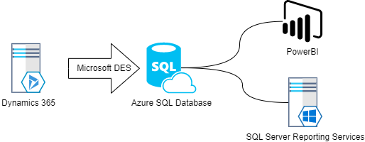
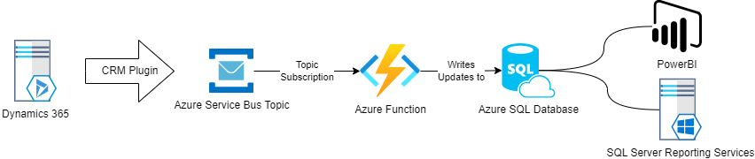

# DQT Reporting Overview

## Background
Reporting on DQT data is currently delivered via SSRS and PowerBI.  These reporting platforms connect to an Azure SQL database that is kept synchronised with DQ data via a Microsoft service called Data Export Service (DES).

On November 23rd 2021, Microsoft announced that this service is being deprecated, and that in November 2022, the service would reach end-of-life.

The document outlines the as-is system, as well as detailing a candidate for its replacement - which is currently a proof of concept.

## As-is 

Currently, the Microsoft Data Export Service connects directly to an Azure SQL database and is administered via a control panel in the CRM UI.  It tracks synchronisation errors and details last update times for entities.

An overview of the DES system, and how to combat synchronisation issues can be found [here](https://docs.microsoft.com/en-us/power-platform/admin/replicate-data-microsoft-azure-sql-database)

The DES creates the initial data copy, and then dispatches queries to the SQL database to deal with the subsequent changes to entities.

## To-be (Proposed)

In order to replace the deprecated DES system, a proof of concept has been created that aims to keep the same Azure SQL database up to date, and cause a minimum on interruption to continued service for downstream consumers (SSRS and PowerBI).

The proof of concept is based on Azure Service Bus, and Azure Functions.

Dynamics 365 (DQT) has a built in plugin that enables events to be dispatched to a service bus topic whenever selected entity types change.  The event contains all relevant fields regarding the change.

A subscription to the topic holds a place in the event stream so that the consumer (Azure Function) can dequeue events in order.  The Azure Function is configured as a Singleton function, so that messages are guaranteed tp be processed sequentially.

The Azure Function analyses the incoming event, and creates INSERT/UPDATE messages that are then dispatched to the Azure SQL server, keeping the data up to date.

### Error handling
The Topic Subscription is configured with a Dead Letter queue.  This configuration means that if the Azure Function encounters an error during processing of an event, the Event is moved to the Dead Letter subqueue where it is to be investigated my humans.

### Caveats
The proposed system has some caveats when compared to the existing system:
* Any new fields that are created on entities in the new system, will attempt to be synchronised.  If the target field does not exist in the database, presently, the entity update query dispatched to the SQL Database will fail.
* The proposed system will not update/populate columns in the target database entity tables that were created for the deprecated DES system.  If these fields are relied upon by downstream consumers (SSRS, PowerBI), these consumers must be updated to use another appropriate field.

