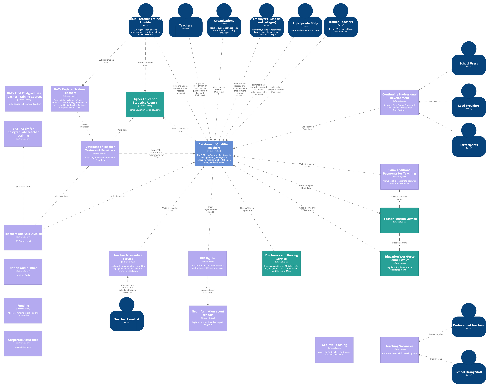
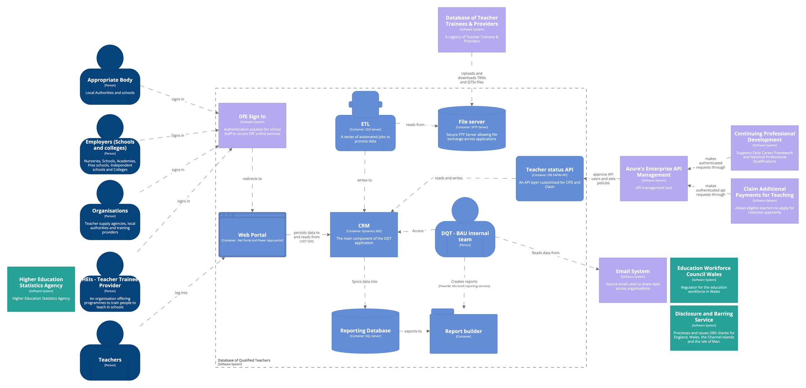
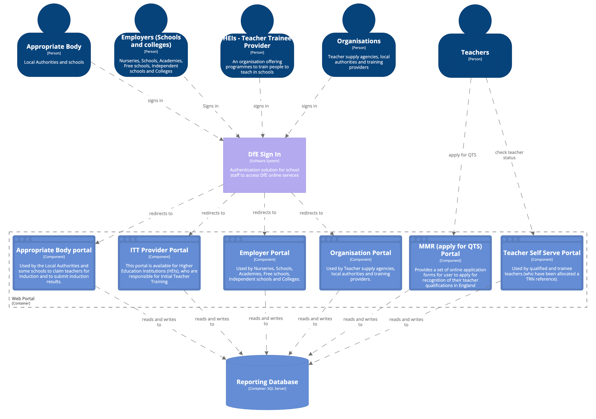
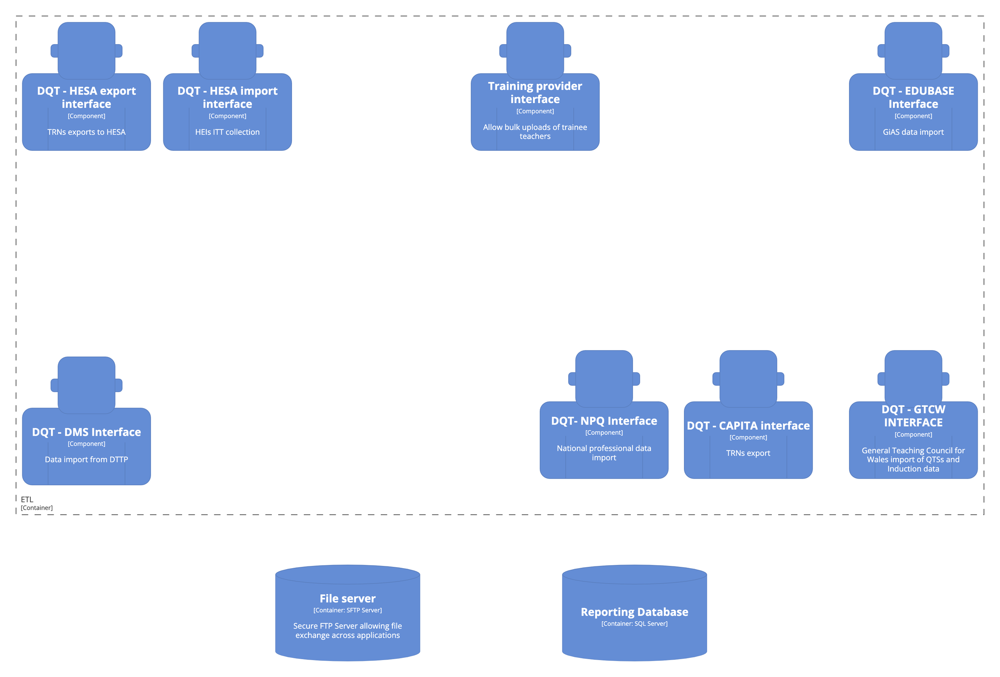

# TRA technical architecture - As is

The following space highlights the technical architecture of the software solution for the Database of Qualified Teachers (DQT) within the Teaching Regulation Agency. 

In line with many other services in Teacher Services we have decided to use [C4](https://c4model.com/) methodology to map out the different layers of the architecture.

> C4 model is a lean graphical notation technique for modelling the architecture of software systems. It is based on a structural decomposition of a system into containers and components and relies on existing modelling techniques such as the [Unified Modelling Language (UML)](https://en.wikipedia.org/wiki/Unified_Modeling_Language) or [Entity Relation Diagrams (ERD)](https://en.wikipedia.org/wiki/Entity%E2%80%93relationship_model) for the more detailed decomposition of the architectural building blocks.

## Core diagrams
Visualising this hierarchy of abstractions is then done by creating a collection of **Context**, **Container**, **Component** and (optionally) **Code** (e.g. UML class) diagrams.

## Level 1: DQT - System Context diagram

## Level 2: DQT - Container diagram

The Container diagram shows the high-level shape of the software architecture and how responsibilities are distributed across it. It also shows the major technology choices and how the containers communicate with one another.

## Level 3: DQT - Component diagram

The Component diagram shows how a container is made up of a number of "components", what each of those components are, their responsibilities and the technology/implementation details.

### DQT Web Portal Component Diagram

### DQT Data Interface Component Diagram

