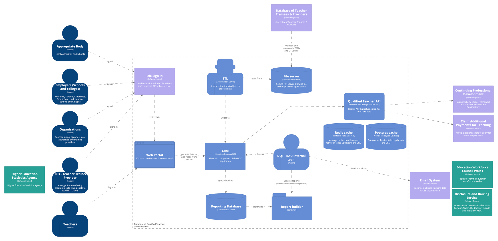
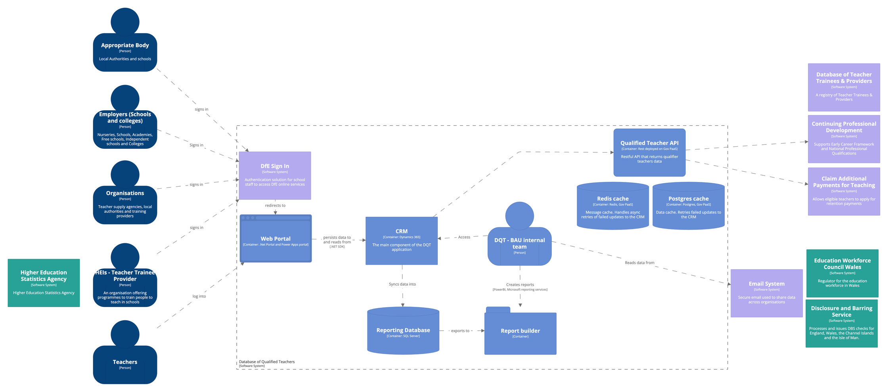

# Technical architecture - future phases

The service team has identified a way forward in improving the current Teacher Status API currently served to two external teams in Teacher Services.

The API, as it stands, does not have a consolidated service definition behind it. It merely supports existing business processes without considering who its users would be and what their needs are.

The API source code is currently held in Azure DevOps. It is deployed into a Policy within the DfE Enterprise API Management tool, acting as a facade to transform incoming and outgoing requests.

We want to move the API out of EAPIM into its separate application container for multiple reasons:

* Our service doesn't need an API Management tool yet. Our API definitions are not mature yet, and we need to have extensive user research and analysis on the underlying data and its use. Having a centralised place, managed by a different team, sitting in between our service and our client would get in the way and slow things down at this stage. We also have engineering experts and in house API and security knowledge and skillset to handle the integration with the only two services that need our API.
* Our use case is pretty simple. We want to provide qualified teacher data to other services. The semantic of such data, the way it's transformed, updated and presented to these's services users, is different and hence delegated.
* Building a complex centralised communication tool that runs logic to route and manipulate messages is an architectural anti-pattern that tends to cause problems later on. Instead, microservices favour a decentralised approach.
* Our service doesn't need analytics on the API at this stage. Our only identified API clients are service teams who need data to support internal business operations. We are not planning to expose data to external users just yet.

## Phase 1
Lift and shift of the current EAPIM API into a separate component.

1. Build new qualified teacher RESTful API application
1. CPD and Claim to consume qualified teacher data from new endpoints
1. Remove EAPIM API

## Phase 2
Migrate legacy system data exchanges, currently working through emails and files, to the new DQT API.

The development of future endpoints is subject to a more mature service (or services) definition.

1. Incrementally build new endpoints for services communication
1. Have services interact with new API application
1. Remove SFTP server
1. Remove SSIS Server
