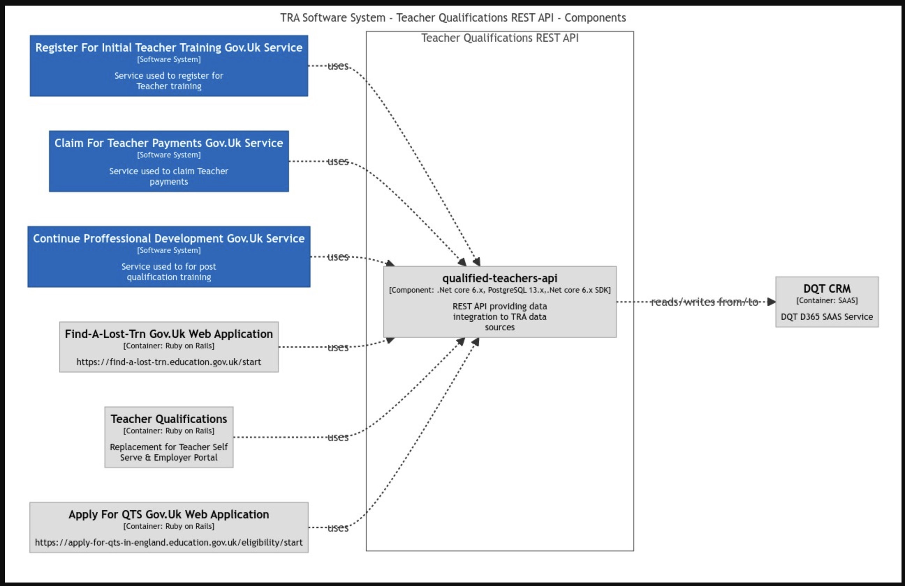
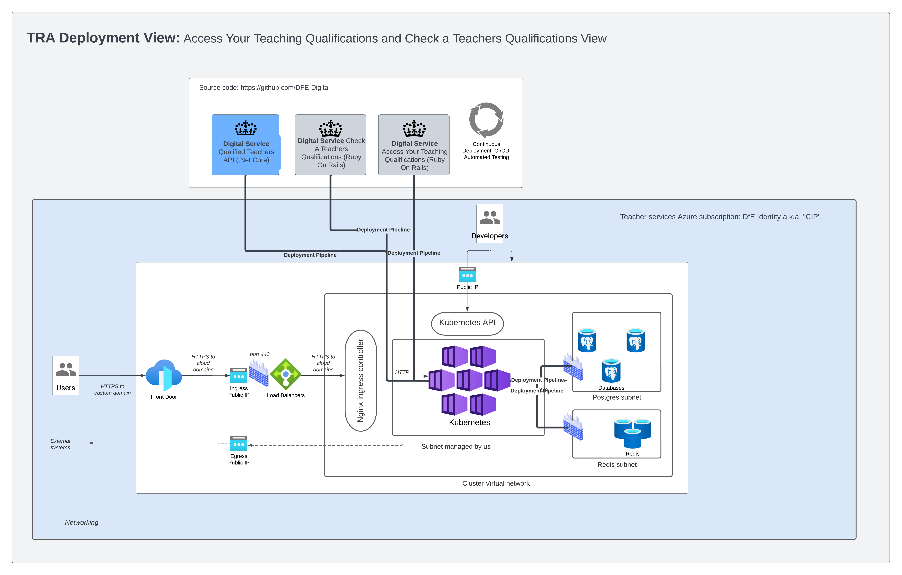

# TRA "DQT" Technical architecture

Views showing the technical architecture of the TRA "Database of Qualified Teachers". It is composed of a number of discreet application contexts, containers and components.

[If your browser isn't letting you focus in on the diagrams download the .png files in the repo](https://github.com/DFE-Digital/database-of-qualified-teachers/tree/main/docs/images)

# Systems and Users Context
This shows the high level view of the TRA "Database of Qualified Teachers" user types and software systems. The technical architecture is currently being transformed from tightly coupled views over the MS Dynamics CRMto a set of discreet GDS style Gov.Uk standard services.

# Users Context

This shows who they are and how the user groups interact with the high level architecture.

# Containers View

This breaks down the high level view and shows how the TRA DQT system is currently composed of 3 main containing technical domains. The biggest container being the CRM and related components. This container will shrink in size as we transform to Gov.Uk aligned digital services. The DQT/Qualified Teachers API container provides a modern (none file based) RESTful API over the TRA data (currently mostly held in the DQT CRM instance). The API will be further developed as we transform from file based data integration to API based integration. The [Find a lost TRN container](images/tra-components-find.jpg) is a Gov.Uk service for finding a Teacher Reference Number (TRN). Built to GDS service standards using the Gov.Uk design kit, it is an enabling service. Many of DfE's Teacher Services require individuals to enter their Teacher Reference Number (TRN). Research showed us that their was a genuine need to help people [find their TRN](https://find-a-lost-trn.education.gov.uk/start). You can see how its performing [here](https://find-a-lost-trn.education.gov.uk/performance). Apply For QTS is a service that allows Teachers from outside the UK apply for Qualified Teacher Status. It is a Gov.Uk service and is built in the same way as Find a Lost TRN.

# CRM Components View

This breaks down the CRM and related components, showing how they are currently implemented and integrated. It shows the current file integrations and the external organisations that share data with DQT. 

# Find a lost TRN Components View

This breaks down the find a lost TRN service components, showing how they are currently implemented and integrated. For a more in depth look and to get the source code head over to the [GITHUB repo](https://github.com/DFE-Digital/find-a-lost-trn).

# Apply For QTS Components View

This breaks down the Apply For QTS components, showing how they are currently implemented and integrated. For a more in depth look and to get the source code head over to the [GITHUB repo](https://github.com/DFE-Digital/apply-for-qualified-teacher-status).

# Qualified Teachers API Components View

This breaks down the qualified teachers API components, showing how they are currently implemented and integrated. For a more in depth look and to get the source code head over to the [GITHUB repo](https://github.com/DFE-Digital/qualified-teachers-api).

# Deployment View
Post GOVPaas migration, all TRA digital services (except legacy portals) will deploy to the DfE Azure AKS landing zone. 

