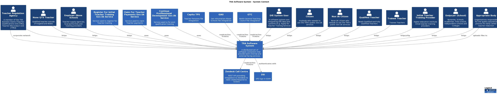
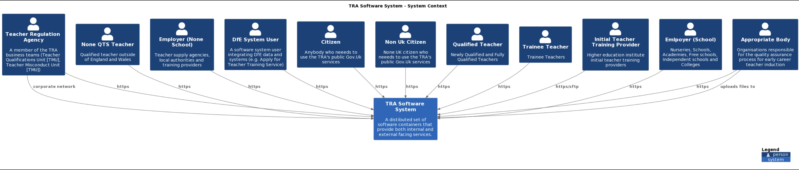
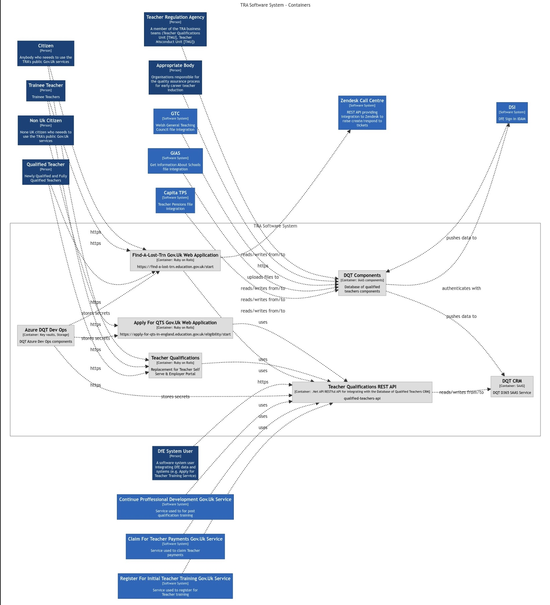
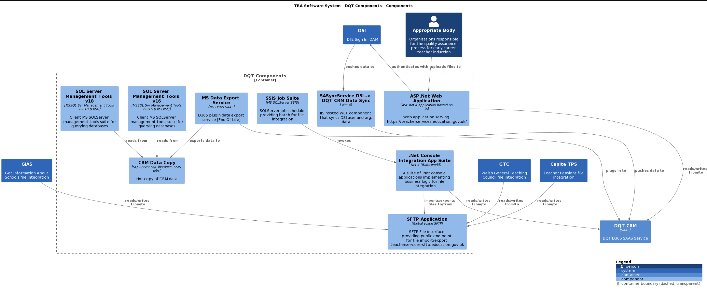
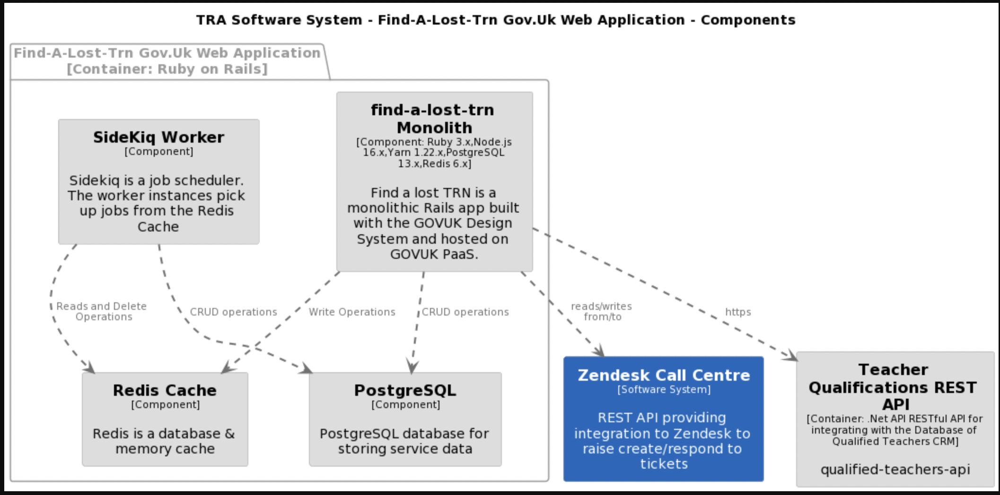
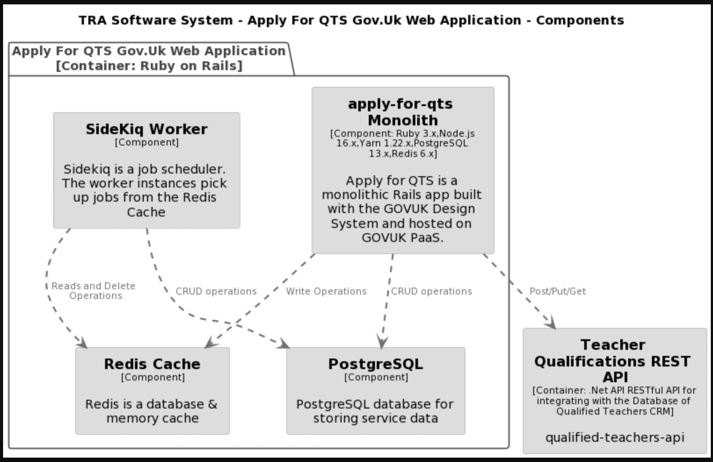
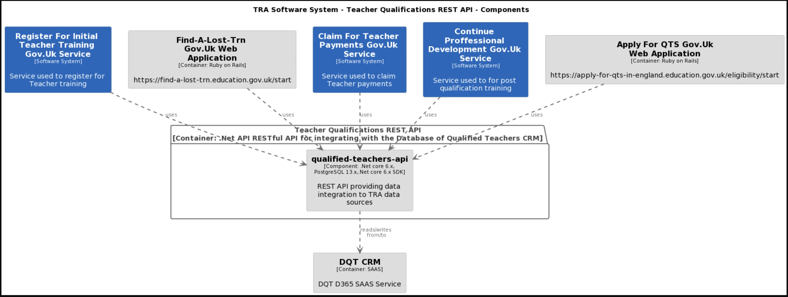
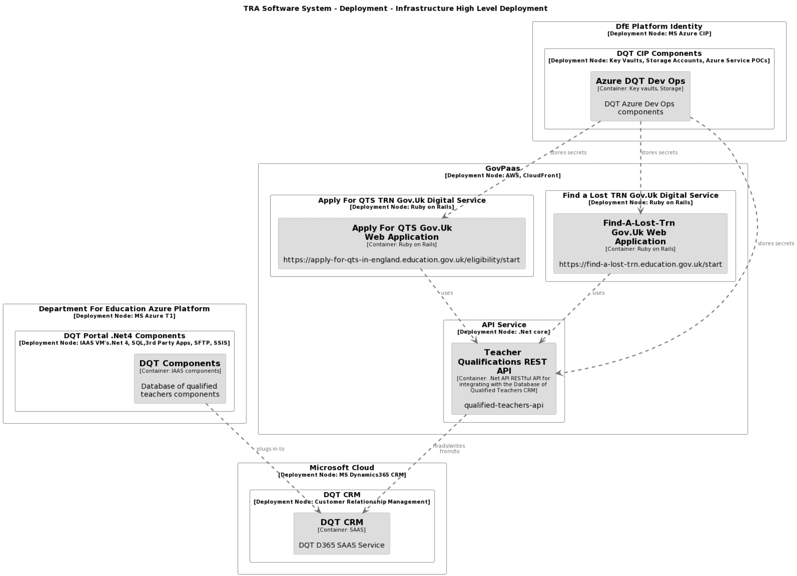

# TRA "DQT" Technical architecture

Views showing the technical architecture of the TRA "Database of Qualified Teachers". It is composed of a number of discreet application contexts, containers and components.

[If your browser isn't letting you focus in on the diagrams download the .png files in the repo](https://github.com/DFE-Digital/database-of-qualified-teachers/tree/main/docs/images)

# Systems and Users Context
This shows the high level view of the TRA "Database of Qualified Teachers" user types and software systems. The technical architecture is currently being transformed from tightly coupled views over the MS Dynamics CRMto a set of discreet GDS style Gov.Uk standard services.

# Users Context

This shows who they are and how the user groups interact with the high level architecture.

# Containers View

This breaks down the high level view and shows how the TRA DQT system is currently composed of 3 main containing technical domains. The biggest container being the CRM and related components. This container will shrink in size as we transform to Gov.Uk aligned digital services. The DQT/Qualified Teachers API container provides a modern (none file based) RESTful API over the TRA data (currently mostly held in the DQT CRM instance). The API will be further developed as we transform from file based data integration to API based integration. The [Find a lost TRN container](images/tra-components-find.jpg) is a Gov.Uk service for finding a Teacher Reference Number (TRN). Built to GDS service standards using the Gov.Uk design kit, it is an enabling service. Many of DfE's Teacher Services require individuals to enter their Teacher Reference Number (TRN). Research showed us that their was a genuine need to help people [find their TRN](https://find-a-lost-trn.education.gov.uk/start). You can see how its performing [here](https://find-a-lost-trn.education.gov.uk/performance). Apply For QTS is a service that allows Teachers from outside the UK apply for Qualified Teacher Status. It is a Gov.Uk service and is built in the same way as Find a Lost TRN.

# CRM Components View

This breaks down the CRM and related components, showing how they are currently implemented and integrated. It shows the current file integrations and the external organisations that share data with DQT. 

# Find a lost TRN Components View

This breaks down the find a lost TRN service components, showing how they are currently implemented and integrated. For a more in depth look and to get the source code head over to the [GITHUB repo](https://github.com/DFE-Digital/find-a-lost-trn).

# Apply For QTS Components View

This breaks down the Apply For QTS components, showing how they are currently implemented and integrated. For a more in depth look and to get the source code head over to the [GITHUB repo](https://github.com/DFE-Digital/apply-for-qualified-teacher-status).

# Qualified Teachers API Components View

This breaks down the qualified teachers API components, showing how they are currently implemented and integrated. For a more in depth look and to get the source code head over to the [GITHUB repo](https://github.com/DFE-Digital/qualified-teachers-api).

# Deployment View

# Technical Architecture Road Map
All technical architecture changes are fundamentally driven by user needs. We take a user centred design approach. Many of the current services require transformation to meet current service needs and GDS digital standards. While we can't let technology alone drive change we have identified a number of strategic milestones we are aiming to deliver in the next 2 years.

## Planned work in 2022
## Implement Continuous Integration
1. All code under source control and made public in [DfE Repos](https://github.com/orgs/DFE-Digital/teams/tra-digital/repositories) Done Jan 2022

## Implement Dev Ops
1. Create deployment pipelines for all of the DQT technical architecture. Ongoing
2. Implement better monitoring and hook into digital tools channels. E.g. [Paas Monitoring](https://github.com/DFE-Digital/tra-paas-monitoring). Ongoing

## Improving data integration by reducing file based DQT data integration and replacing with API based integration
1. Build new [Teacher Qualifications API](https://github.com/DFE-Digital/qualified-teachers-api). Done Live Feb 2022
2. [Register Trainee Teachers](https://www.register-trainee-teachers.education.gov.uk/), [Continuing Professional Development](https://manage-training-for-early-career-teachers.education.gov.uk/) and Claim Additional Teacher Payments integrated via qualified teacher data from new endpoints. Done Live March 2022
3. Build new "TRN less" integration with [Continuing Professional Development](https://manage-training-for-early-career-teachers.education.gov.uk/). This is the first delivery that starts to improve the way in which DfE digital services integrate teacher records, so that we can:
    Help Teachers by reducing the amount of times we ask them for thier information.
    Better inform policy by more accurately identifying Teachers, Trainees and Applicants across the DfE Teacher Service Line.

## Building new services to address user needs

1. Build new [Find a lost TRN Service](). To help users find their Teacher Reference Number quickly and digitally. Done Live May 2022
2. Build new Professional Recognition digital service. Done Live November 2022

## Overall themes

1. Automate as much as possible through CI and CD pipelines.
2. Reduce manual intervention in data integrations by removing file / manual based with API's.
3. Monitor performance, security / access, errors and publish into actively managed channels.
4. Re-factor existing brittle code by strangulation.
5. Open source everything (except secrets etc.)
6. Simplify the technical architecure and reduce legacy technology footprint.
7. Stop collecting unessessary data.
8. Make our data more useable by removing duplications, streamlining data sets and better sharing with related DfE services.