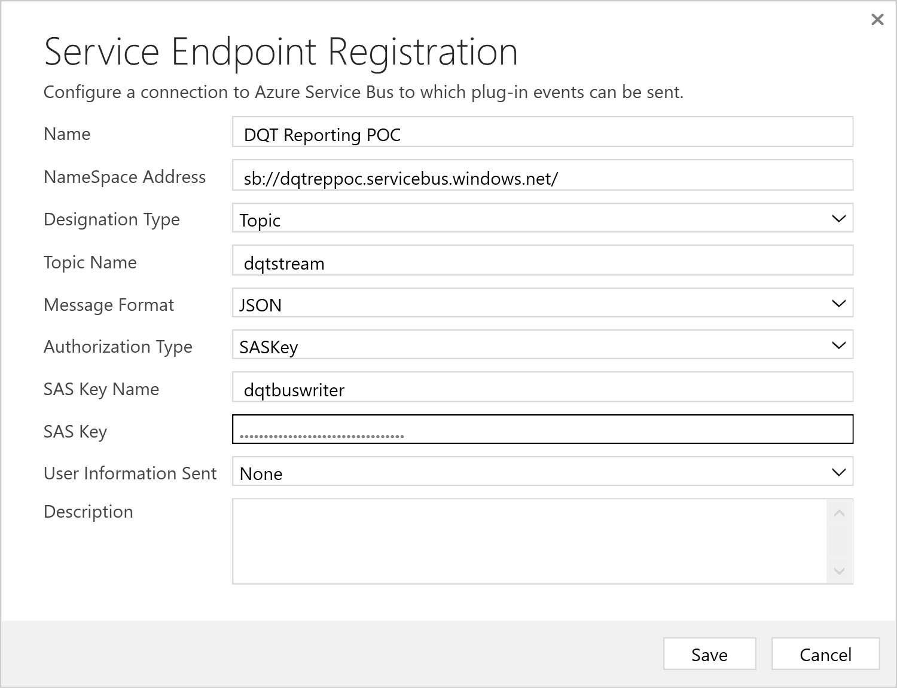
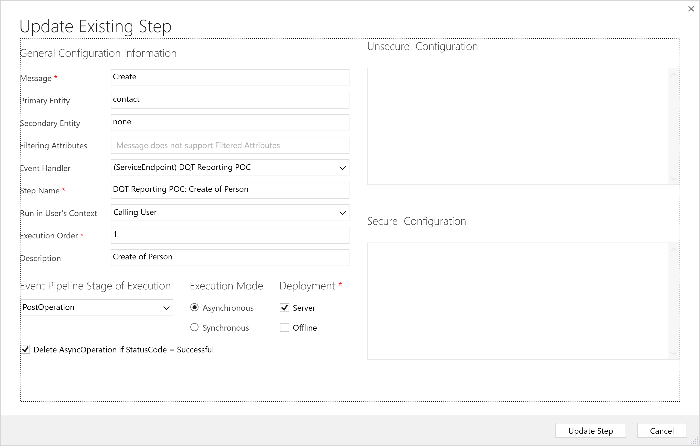
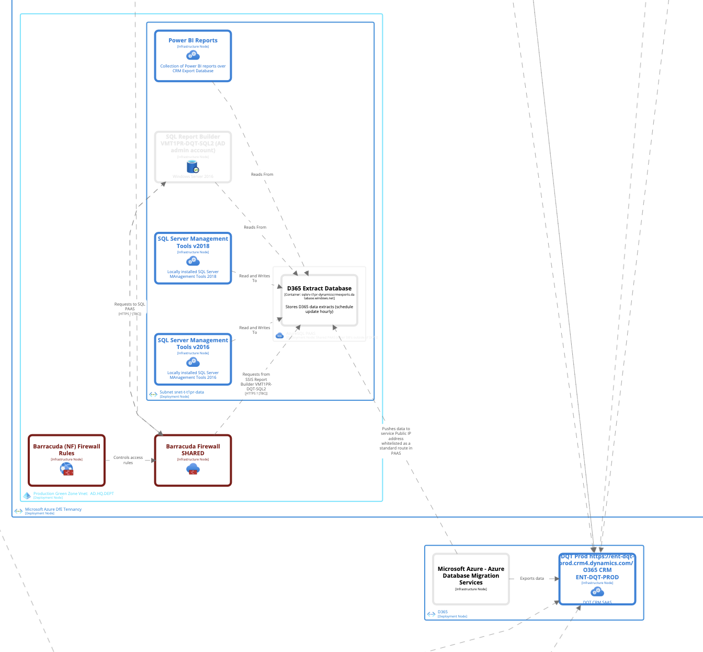
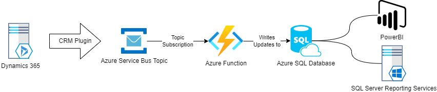
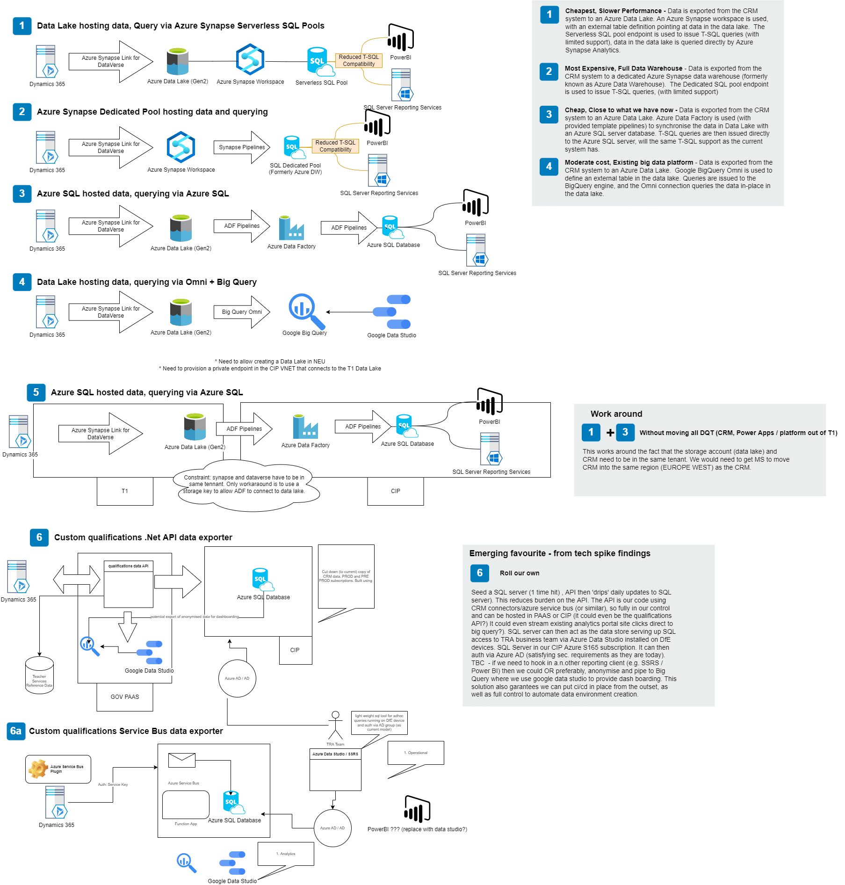

# DQT Reporting Proof Of Concept

This folder houses the code for a working proof-of-concept that synchornises data between the DQT (build) and an instance of Azure SQL - so that reporting users can query DQT data using traditional SQL.

## TLDR; Local set up

### Prerequisites
* [Dotnet CLI](https://docs.microsoft.com/en-us/dotnet/core/tools/)
* [Azure Functions Core Tools](https://github.com/Azure/azure-functions-core-tools)

### How to run locally

```
cd dqt-reporting-poc
func start
```

## Solution Components

The solution consists of the following four components:

### Azure Service Bus Topic

Azure Service Bus Topics are an implementation of the pub/sub model.  We create a topic (A target for publishing events), and each topic can have zero or more configured subscriptions. We create a Shared Access Key with write permissions, and configure the DQT to write to this topic using the SAS Key with write access.

### DQT (Dynamics 365 configuration)

Microsoft Dynamics 365 has a built-in feature called Service Endpoint plugins.  One such plugin enables us to connect to an Azure Service Bus Topic, and publish events to it.  These events (Create, Update, Delete) contain information about the changes to the entity that the trigger is placed on.  In our PoC, we configured the build CRM with Create and Update on the contact entity, and configured the service bus as the target, using the SAS key configured as above





### Azure Function

The Azure Function contains the logic that interprets the events from the DQT CRM into insert/update statements which are executed on the Azure SQL instance.  The function is written in C#, and is deployed using the dotnet deploy command.

The function expects the following configuration values to be provided:

* "dqtreppoc_SERVICEBUS" -  An service bus connection string, containing the SAS key
* "targetdb" - A database connection string for the target Azure SQL instance

### Azure SQL Instance

The Azure SQL instance needs to be configured with the schema that matches the existing reporting database, as well as the functions that are commonly used by the various reports ran on the data.  The database schema create scripts  can be found in the Database folder.

# Architectural Overview

## Background
Reporting on DQT data is currently delivered via SSRS and PowerBI.  These reporting platforms connect to an Azure SQL database that is kept synchronised with DQ data via a Microsoft service called Data Export Service (DES).

On November 23rd 2021, Microsoft announced that this service is being deprecated, and that in November 2022, the service would reach end-of-life.

The document outlines the as-is system, as well as detailing a candidate for its replacement - which is currently a proof of concept.

## As-is 

Currently, the Microsoft Data Export Service connects directly to an Azure SQL database and is administered via a control panel in the CRM UI.  It tracks synchronisation errors and details last update times for entities.

An overview of the DES system, and how to combat synchronisation issues can be found [here](https://docs.microsoft.com/en-us/power-platform/admin/replicate-data-microsoft-azure-sql-database)

The DES creates the initial data copy, and then dispatches queries to the SQL database to deal with the subsequent changes to entities.




## To-be (Proposed)

In order to replace the deprecated DES system, a proof of concept has been created that aims to keep the same Azure SQL database up to date, and cause a minimum on interruption to continued service for downstream consumers (SSRS and PowerBI).

The proof of concept is based on Azure Service Bus, and Azure Functions.

Dynamics 365 (DQT) has a built in plugin that enables events to be dispatched to a service bus topic whenever selected entity types change.  The event contains all relevant fields regarding the change.

A subscription to the topic holds a place in the event stream so that the consumer (Azure Function) can dequeue events in order.  The Azure Function is configured as a Singleton function, so that messages are guaranteed tp be processed sequentially.

The Azure Function analyses the incoming event, and creates INSERT/UPDATE messages that are then dispatched to the Azure SQL server, keeping the data up to date.

### Error handling
The Topic Subscription is configured with a Dead Letter queue.  This configuration means that if the Azure Function encounters an error during processing of an event, the Event is moved to the Dead Letter subqueue where it is to be investigated my humans.




## Alternative Solutions

Various solutions have been evaluated, and detailed in the diagram below:



### Solution selection considerations

The decision to pursue option 6a (detailed "to-be" above) arose from the following factors:

* The use of Azure Synapse Link for Dataverse requires that the Dynamics 365 Deployment and the Azure Subscription housing the target Azure Data Lake/Azure synapse workspace be linked to the same Tenant.  Since CIP (where our proposed data lake/synapse workspace would be housed) has a different tenant to DQT D365, Options 1,2,3 and 4 would require a large data migration exercise, where security entities (Users and Groups) would need to be "Mapped" over to equivalent users and groups in the CIP associated tenant.
* Both the Dynamics 365 DQT CRM and the target data lake/synapse workspace must be in the same region for Azure Synapse Link for Dataverse to function.  Currently, the DQT is hosted in North Europe and Azure Policy dictates that Azure resources must be created in West Europe.  This means options 1 through 4 are impeded.
    * Possible to migrate the DQT CRM to West Europe
    * Also possible to negotiate policy exception with Tech group
* Option 5 presents a workaround by deploying part of the infrastructure in T1, and using Azure Data Factory to create a managed virtual endpoint connecting to the Azure Data Lake.  The downsides are increased constraint to ways of working (Due to shared T1 approach), as part of the infrastructure is hosted in T1.
* Option 6 avoids using the Azure Synapse Link for Dataverse, bypassing the region and tenant constraints.  Updates are in near real time due to the event based nature of the integration, and the existing database would be updated to leave current integrations in place. Pub/Sub approach means other data consumers could more easily be integrated into the solution.

### Caveats for PoC
The proposed system has some caveats when compared to the existing system:
* Any new fields that are created on entities in the new system, will attempt to be synchronised.  If the target field does not exist in the database, presently, the entity update query dispatched to the SQL Database will fail.
* The proposed system will not update/populate columns in the target database entity tables that were created for the deprecated DES system.  If these fields are relied upon by downstream consumers (SSRS, PowerBI), these consumers must be updated to use another appropriate field.

## Outstanding Considerations
* How would each of the proposed solutions react to new fields being added to the DQT?
* Do any reports use fields that are created/updated by MS DES, that will no longer be serviced?

